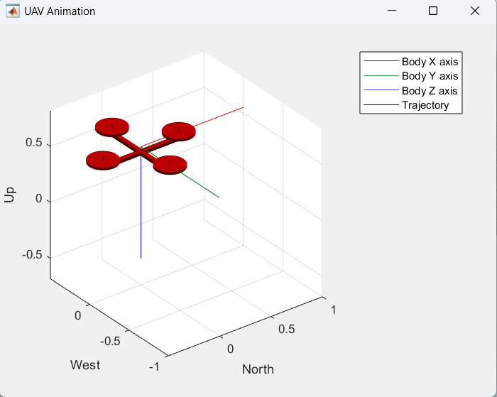
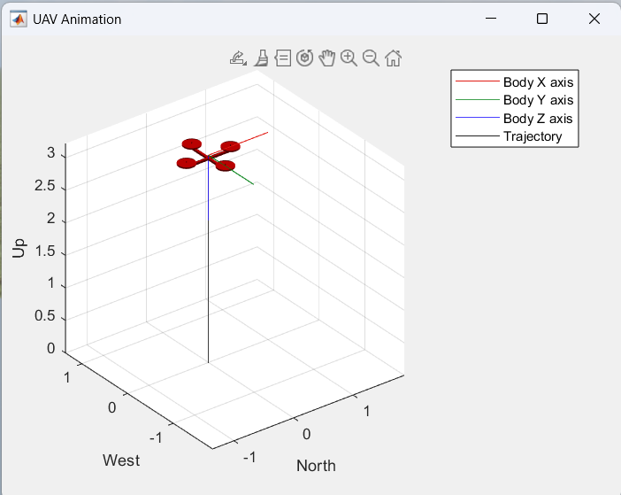
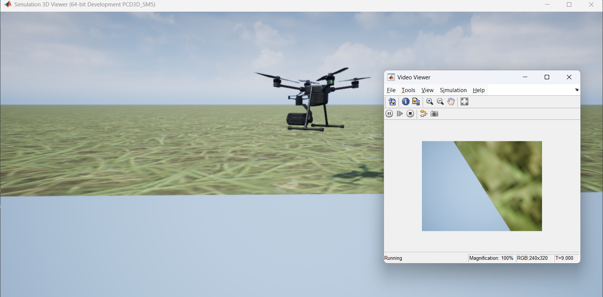
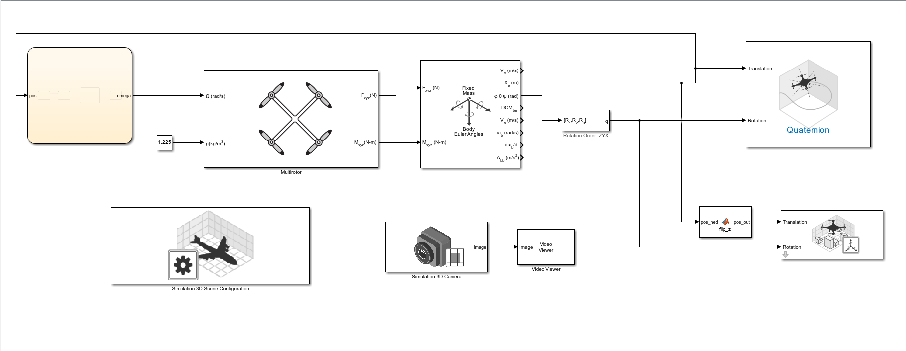
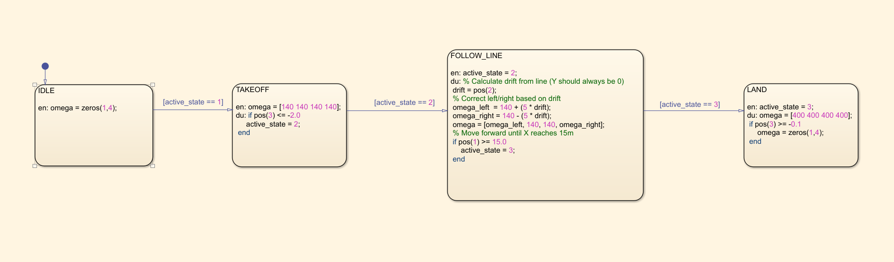

# Autonomous Drone Simulation — MATLAB/Simulink/Stateflow

A fully simulated autonomous drone built from scratch using MATLAB, Simulink, Stateflow, and UAV Toolbox — no hardware required.

The drone takes off, follows a mathematically defined line path using a proportional feedback controller, and lands at a target destination. All flight logic is managed by a Stateflow finite state machine.

---

## UAV Animation

<p align="center">
  
  <br>
  <em>at time T=10.0</em>
</p>
<br>

<p align="center">
  
  <br>
  <em>at time T=30.0</em>
</p>
<br>

---

## 3D Simulation with Camera view

<p align="center">
  
  <br>
  <em>3D Simulator</em>
</p>
<br>

---

## How It Works

The system is a **closed-loop feedback control system** — the drone continuously measures its own position and corrects its behaviour accordingly.

---

### Data Flow:
```
Stateflow (Brain)
      │
      │ omega (rotor speeds)
      ▼
Multirotor Block (Rotor Physics)
      │
      │ Forces (Fxyz) & Moments (Mxyz)
      ▼
6DOF Dynamics Block (Physics Engine)
      │
      │ Position (Xe) & Angles (φθψ)
      ▼
UAV Animation + 3D Viewer (Visualisation)
      │
      │ Position fed BACK to Stateflow
      └──────────────────────────────────▶ Stateflow

```

---

### Simulink Canvas:
<p align="center">
  
  <br>
  <em>Drone Controller</em>
</p>
<br>

---

### StatefLow Chart:

<p align="center">
  
  <br>
  <em>Flight State Machine</em>
</p>
<br>

---

| State | What Drone Does | Exit Condition |
|---|---|---|
| **IDLE** | All rotors stopped, sitting on ground | Immediately transitions to TAKEOFF |
| **TAKEOFF** | All 4 rotors spin equally, drone climbs vertically | Altitude reaches 0.5m (pos(3) <= -0.5 in NED) |
| **FOLLOW_LINE** | P-controller corrects lateral drift, drone flies forward | Forward distance reaches 15m (pos(1) >= 15.0) |
| **LAND** | Rotors slow down, drone descends gradually | Near ground level (pos(3) >= -0.1) |

---

## System Architecture

### Simulink Blocks Used:

| Block | Toolbox | Purpose |
|---|---|---|
| Stateflow Chart | Stateflow | Flight logic state machine — the brain |
| Multirotor | UAV Toolbox | Simulates rotor physics (omega → forces) |
| 6DOF (Euler Angles) | Aerospace Blockset | Converts forces to position and orientation |
| UAV Animation | UAV Toolbox | Lightweight 3D trajectory visualiser |
| Simulation 3D Scene | Simulation 3D | Unreal Engine-based realistic world |
| Simulation 3D UAV Vehicle | Simulation 3D | Places drone model in 3D world |
| Simulation 3D Camera | Simulation 3D | Downward-facing camera for ground observation |
| Euler→Quaternion (MATLAB Fn) | Custom | Converts Euler angles to Quaternion for animation |
| flip_z (MATLAB Fn) | Custom | Converts NED coordinates to 3D viewer ENU frame |

### Line Following — P-Controller Logic:
```matlab
drift = pos(2);                          % How far off Y=0 the drone is
omega_left  = 160 + (5 * drift);        % Increase left rotors if drifted right
omega_right = 160 - (5 * drift);        % Decrease right rotors if drifted right
omega = [omega_left, 160, 160, omega_right];
```
A proportional gain (Kp = 5) corrects lateral drift — bigger drift gets bigger correction.

---

## Tools & Toolboxes

- **MATLAB R2025**
- **Simulink**
- **Stateflow**
- **UAV Toolbox**
- **Aerospace Blockset**
- **Simulation 3D (Unreal Engine)**
- **Image Processing Toolbox**

---

## How to Run

>  Requires MATLAB with the toolboxes listed above

1. Clone or download this repository
2. Open MATLAB and set your working directory to this folder:
```matlab
cd 'path/to/drone-simulation-matlab'
```
3. Run the setup scripts in the Command Window:
```matlab
CreateLine
DroneSimSetup
```
4. Open the Simulink model:
```matlab
open('DroneController.slx')
```
5. Press the green **▶ Play** button in Simulink

### Output:
- **Simulation 3D Viewer** — realistic 3D simulated world with drone flying
- **UAV Animation** — 3D trajectory plot showing flight path
- **Video Viewer** — live downward camera feed from drone

---

## Project Structure

```
drone-simulation-matlab/
│
├── DroneController.slx     ← Main Simulink model (all blocks & connections)
├── DroneSimSetup.m         ← Initialises drone parameters before simulation
├── CreateLine.m            ← Defines the mathematical line path
├── line_data.mat           ← Saved line coordinate data
├── .gitignore              ← Excludes MATLAB auto-generated files
├── README.md               ← This file
│
└── images/                 ← Screenshots (add after taking them)
    ├── simulink_canvas.png
    ├── stateflow_chart.png
    └── simulation_demo.png
```

---

## Concepts Demonstrated

- **Finite State Machine (FSM)** design using Stateflow
- **Closed-loop feedback control** — position measured and fed back continuously
- **6DOF rigid body dynamics** — realistic drone physics
- **Coordinate frame conversion** — NED ↔ ENU transformation
- **Proportional controller** — lateral drift correction
- **Sensor integration** — downward camera attached to drone body
- **3D simulation** — Unreal Engine-based environment

---

## Future Phases

- [x] Phase 1 — Simulink environment setup
- [x] Phase 2 — Stateflow state machine + basic flight
- [x] Phase 3 — Camera integration + line following P-controller
- [ ] Phase 4 — PID controller for stable altitude and position hold
- [ ] Phase 5 — Image processing for visual line detection
- [ ] Phase 6 — Waypoint-based path planning
- [ ] Phase 7 — Precision landing marker detection

---
